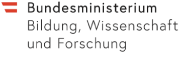

.. _rest_api:

ixmp REST API
=============

The ixmp REST Application Programming Interface (API) allows
to programmatically use the IIASA modeling platform server
as a data warehouse for scenario analysis.

The ixmp package and the related REST API are the backbone
of IIASA's :ref:`scenario_explorer`,
but they can also be used and accessed by a wide range of programming languages,
applications or scripts. This allows, for example, building web-based tools
that visualize or otherwise use data included in a scenario explorer instance.

The credentials and permissions are managed by a separate
`ECE Authentication Server <https://data.ece.iiasa.ac.at/auth/>`_.
Thus, the login part - getting an access token and getting/setting user
permissions - is handled via the authentication server.
The actual data are then accessed via the ixmp REST API,
using the token and permissions received by the authentication server.

The full documentation of the ixmp REST API, which includes information about
accessing the separate Authentication server, is available at postman.

.. seealso::

   `ixmp REST API Documentation <https://documenter.getpostman.com/view/1057691/SWE6Zcmd>`_

Funding acknowledgement
-----------------------

The ixmp REST API was initially developed at IIASA under the
`SENSES project <http://senses-project.org>`_
which is part of the JPI Climate ERA-Net Cofund for Climate Services with
co-funding by the European Union under grant agreement No. 690462,
the Austrian Federal Ministry of Science and Research
via the Austrian Research Promotion Agency (FFG).

.. |logo_ec| image:: _static/eu_flag.jpg
   :target: https://ec.europa.eu
   :width: 80px
   :alt: European Commission

|logo_senses|
|logo_ec|
|logo_bmbwf|
