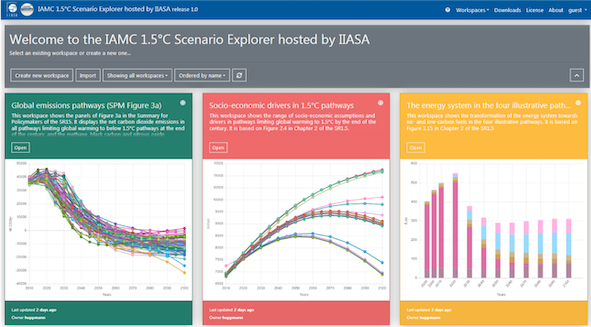

.. _scenario_explorer:

Scenario Explorer 
=================

The Scenario Explorer is a web-based user interface for scenario results
and historical reference data.
It provides intuitive visualizations & display of timeseries data
and download of the data in multiple formats.

Workspaces for dissemination & collaboration
--------------------------------------------

The Scenario Explorer has a feature for saving and sharing “workspaces”;
see below the landing page for the *IAMC 1.5°C Scenario Explorer*
supporting the IPCC SR15,
which replicates three iconic figures from the report based
on the quantitative scenario ensemble.

Workspaces can be generated for the public such that every user
sees them on login.
Alternatively, they can be created by any user and shared bilaterally
with colleagues or on social-media.

   The `IAMC 1.5°C Scenario Explorer`_ was the first application |br|
   of the IIASA modeling platform infrastructure

.. _`IAMC 1.5°C Scenario Explorer`: https://data.ece.iiasa.ac.at/iamc-1.5c-explorer

Scenario management
-------------------

The Scenario Explorer also has an interface for uploading and
managing scenario data as a central data repository
in multi-institution model comparison exercises.
The infrastructure includes data version control and allows to run scenario
post-processing on any uploaded data (e.g., validation, consistency,
meta-analysis).
