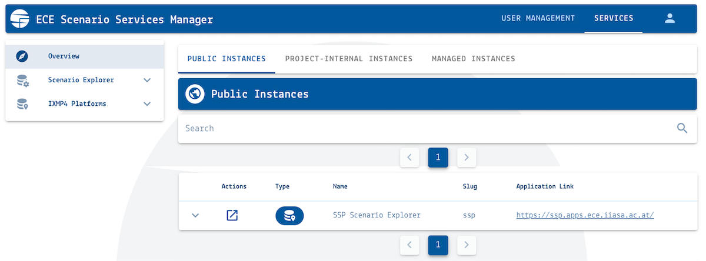

.. _scenario-databases:

Scenario databases hosted by IIASA
==================================

The *Energy, Climate and Environment* program (ECE) at IIASA is hosting many databases
for the community to facilitate scenario analysis, model comparison and dissemination.

Access and permission management
--------------------------------

There are public and project-internal (private) databases. Access to project-internal
instances is managed via the `Scenario Services Manager`_.
To participate in a project, please create an account and send the username
to the project managers by email.

You can see all public and private database instances to which you have access,
including your view/submit/edit permissions, in the *Services* tab of the manager.

   Screenshot of the "Overview" page of the `Scenario Services Manager`_

.. _`Scenario Services Manager`: https://manager.ece.iiasa.ac.at

Model registration
------------------

To participate in a model comparison project using the IIASA scenario database infrastructure,
you have to "register" your model. A model registration requires three specifications:

* A model name including a *version number*, preferably using
  `semantic versioning <https://semver.org>`_
* A list or mapping of region names as they will be submitted (uploaded) to an IIASA
  database instance by the modeling team, and how the region names should appear
  in the processed scenario data
* A model mapping to perform region aggregation from *native_regions* to
  *common_regions* and renaming of model native regions (optional)

Option 1) Registration using an Excel template
^^^^^^^^^^^^^^^^^^^^^^^^^^^^^^^^^^^^^^^^^^^^^^

If you do not feel comfortable using GitHub, please use the `Excel template`_ and send
it to the project managers by email.

.. _`Excel template`: https://raw.githubusercontent.com/IAMconsortium/nomenclature/main/templates/model-registration-template.xlsx

Option 2) Registration using a GitHub pull request
^^^^^^^^^^^^^^^^^^^^^^^^^^^^^^^^^^^^^^^^^^^^^^^^^^

The preferred approach for model registration is starting a GitHub pull request.
Please contact the administrators if permissions for the project repository
are required.

Please follow the `Model registration user guide
<https://nomenclature-iamc.readthedocs.io/en/stable/user_guide/model-registration.html>`_.

Scenario version management
---------------------------

When submitting a scenario (a.k.a. "run") to an IIASA database instance with an already
existing model-scenario combination, the database will save the new submission as a new version
of that run. The **version number** is incremented automatically and the new version
will be automatically set as **default version** for that model-scenario name.

To select other (non-default) versions, you can use the "Switch to Advanced View" button
in the scenario-selection tab of an IIASA Scenario Explorer or you can use the
:code:`default_only=False` option of the function :func:`pyam.read_iiasa()`
or the **ixmp4** package (`read the docs <https://docs.ece.iiasa.ac.at/ixmp4>`_).

Scenario processing
-------------------

When submitting a scenario (a.k.a. "run") to an IIASA database instance, the server
processes the data and performs *region-aggregation* and *scenario validation*.
The processing uses the **nomenclature** package
(`read the docs <https://nomenclature-iamc.readthedocs.io>`_).

The region-aggregation and validation is configured via a project-specific GitHub
repository. Please contact the respective project managers or the Scenario Services
team if you need access.

Local scenario processing
^^^^^^^^^^^^^^^^^^^^^^^^^

A project workflow can be run on a scenario locally, before submission to an IIASA
database instance. This can be useful to test region-aggregation and validation.

To run the project workflow locally, do the following:

1. Install Python and run ``pip install nomenclature-iamc`` to install the package
2. Git-clone the project repository
   (usually `https://github.com/iiasa/<project>-workflow`_)

Then, run the workflow on a scenario data file using the terminal (from the folder where
the project repository was cloned to).

.. code::

    nomenclature validate-scenario <path-to-scenario-file>.xlsx

.. warning::

    Make sure to pull the latest project repository and update the **nomenclature** package
    when you repeat this step later to make sure that the IIASA infrastructure and your
    local check are in sync.

Read the `User Guide`_ of the **nomenclature** package for more information!

.. _`https://github.com/iiasa/<project>-workflow`: https://github.com/iiasa

.. _`User Guide`: https://nomenclature-iamc.readthedocs.io/en/stable/user_guide/local-usage.html