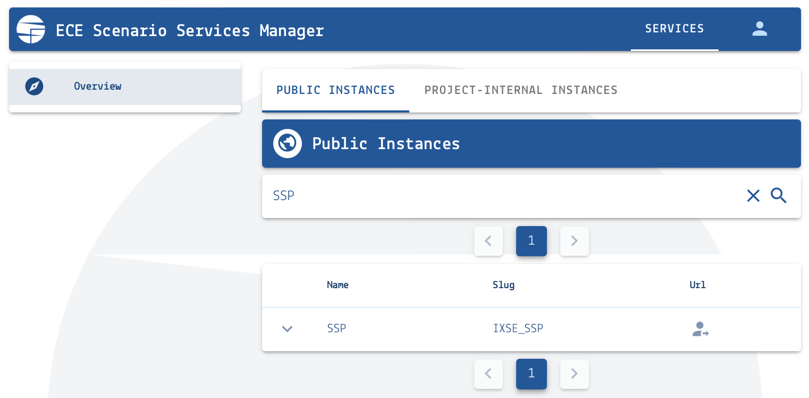

.. _scenario-databases:

Scenario databases hosted by IIASA
==================================

The *Energy, Climate and Environment* program (ECE) at IIASA is hosting many databases
for the community to facilitate scenario analysis, model comparison and dissemination.

Access and permission management
--------------------------------

There are public and project-internal (private) database instances or **platforms**.
Access to project-internal platforms is managed via the `Scenario Services Manager`_.
To participate in a project, please create an account and send the username
to the project managers by email.

You can see all public and private database instances to which you have access,
including your view/submit/edit permissions, in the *Services* tab of the manager.



   Screenshot of the "Overview" page of the `Scenario Services Manager`_

.. _`Scenario Services Manager`: https://manager.ece.iiasa.ac.at

Model registration
------------------

To participate in a model comparison project using the IIASA scenario database infrastructure,
you have to "register" your model. A model registration requires three specifications:

* A model name including a *version number*, preferably using
  `semantic versioning <https://semver.org>`_
* A list or mapping of region names as they will be submitted (uploaded) to an IIASA
  database instance by the modeling team, and how the region names should appear
  in the processed scenario data
* A model mapping to perform region aggregation from *native_regions* to
  *common_regions* and renaming of model native regions (optional)

Option 1) Registration using an Excel template
^^^^^^^^^^^^^^^^^^^^^^^^^^^^^^^^^^^^^^^^^^^^^^

If you do not feel comfortable using GitHub, please use the `Excel template`_ and send
it to the project managers by email.

.. _`Excel template`: https://raw.githubusercontent.com/IAMconsortium/nomenclature/main/templates/model-registration-template.xlsx

Option 2) Registration using a GitHub pull request
^^^^^^^^^^^^^^^^^^^^^^^^^^^^^^^^^^^^^^^^^^^^^^^^^^

The preferred approach for model registration is starting a GitHub pull request.
Please contact the administrators if permissions for the project repository
are required.

Please follow the `Model registration user guide
<https://nomenclature-iamc.readthedocs.io/en/stable/user_guide/model-registration.html>`_.

Scenario version management
---------------------------

When submitting a scenario (a.k.a. "run") to an IIASA database instance with an already
existing model-scenario combination, the database will save the new submission as a new version
of that run. The **version number** is incremented automatically and the new version
will be automatically set as **default version** for that model-scenario name.

To select other (non-default) versions, you can use the "Switch to Advanced View" button
in the scenario-selection tab of an IIASA Scenario Explorer or you can use the
:code:`default_only=False` option of the function :func:`pyam.read_iiasa()`
or the **ixmp4** package (`read the docs <https://docs.ece.iiasa.ac.at/ixmp4>`_).

.. _scenario-processing:

Scenario processing
-------------------

When submitting a scenario (a.k.a. "run") to an IIASA database instance, the server
executes a scenario-processing workflow including *region-aggregation* and *scenario
validation* prior to saving the scenario to the database. The processing uses the
**nomenclature** package (`read the docs <https://nomenclature-iamc.readthedocs.io>`_).

The region-aggregation and validation is configured via a project-specific GitHub_
repository, usually named `https://github.com/iiasa/<project>-workflow`_. Please contact
the respective project managers or the Scenario Services team if you need access.

The workflow for processing files uploaded via the IIASA Scenario Explorer is
implemented in a modular fashion. This makes it straightforward to execute programs,
code and tools developed by (non-IIASA) research partners as part of the processing
workflow.

Requirements for processing modules
^^^^^^^^^^^^^^^^^^^^^^^^^^^^^^^^^^^

Any module (a.k.a. program, code or tool) must adhere to the following standards of
best-practice software development. The aim of these guidelines is to ensure reliability
of our services, minimize maintenance requirements, and guarantee reproducibility of
results across platforms.

General requirements
````````````````````

- The program, code or tool must be implemented in Python (≥3.7) or R; compiled
  executables are not acceptable for security reasons
- Distribution of the source code
  - via an online version-controlled repository
  (preferably GitHub) to which the IIASA admin team has access; or
  - installation via a package manager (pip, conda, CRAN).
- The program must run on Debian (preferably Ubuntu)
- The dependencies must be clearly stated,
  e.g. as Dockerfile (describing execution environment, library dependencies etc.)
  Python package dependencies according to packaging user guide (e.g. as environment.yml, requirements.txt etc.)
  R dependencies
- The license must be clearly stated.
- The documentation of the program, code or tool must include:
  - Purpose of the program and individual top-level functions
  - Instructions how to run the program
  - Expected input (variables, region mappings) and standard output
  - Explanation of any settings and optional parameters

Application programming interface
`````````````````````````````````

**Option 1**:

The module is called via a command-line interface (CLI)
and take the following arguments:

- :code:`input`: path to an IAMC-formatted file (:code:`xlsx` or :code:`csv`)
- :code:`output`: path where to write an output file
  (usually derived timeseries data) in the same format
- Any relevant settings and optional parameters must also be specified
  via the CLI

e.g. :code:`"python process.py --input path-to-input-file.xlsx --output path-to-output-file.xlsx"`

**Option 2** (applicable for packages/functions written in Python):

Importable Python functions that take and return :class:`pandas.DataFrame` (with columns
folllowing the IAMC format) or :class:`pyam.IamDataFrame` objects can be called as part
of the processing workflow. Any settings or optional parameters must be given as keyword
arguments to the top-level function, preferably with the option to set them via a
settings or configuration file.

.. _GitHub: https://www.github.com

.. _`https://github.com/iiasa/<project>-workflow`: https://github.com/iiasa

